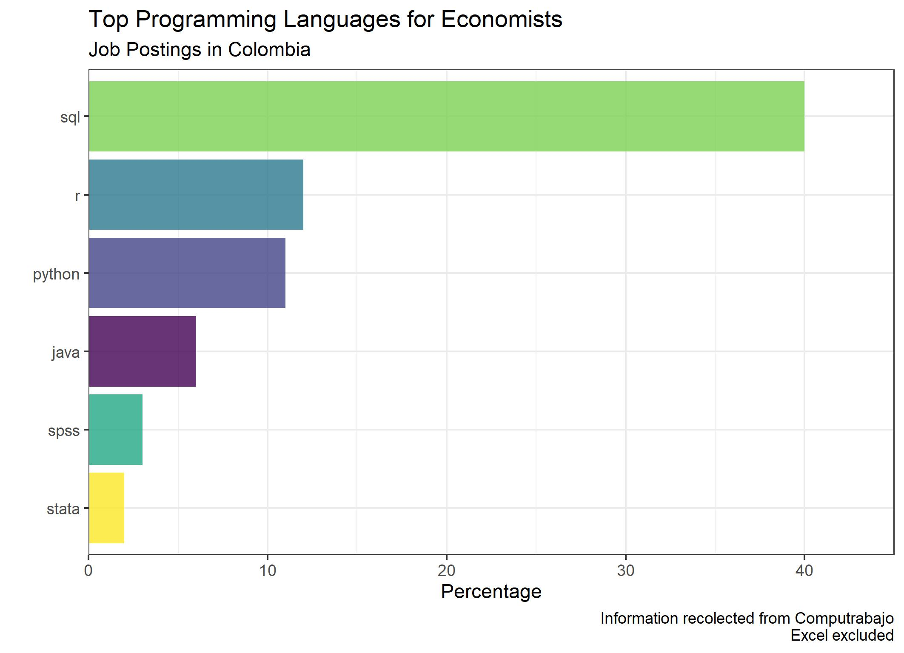
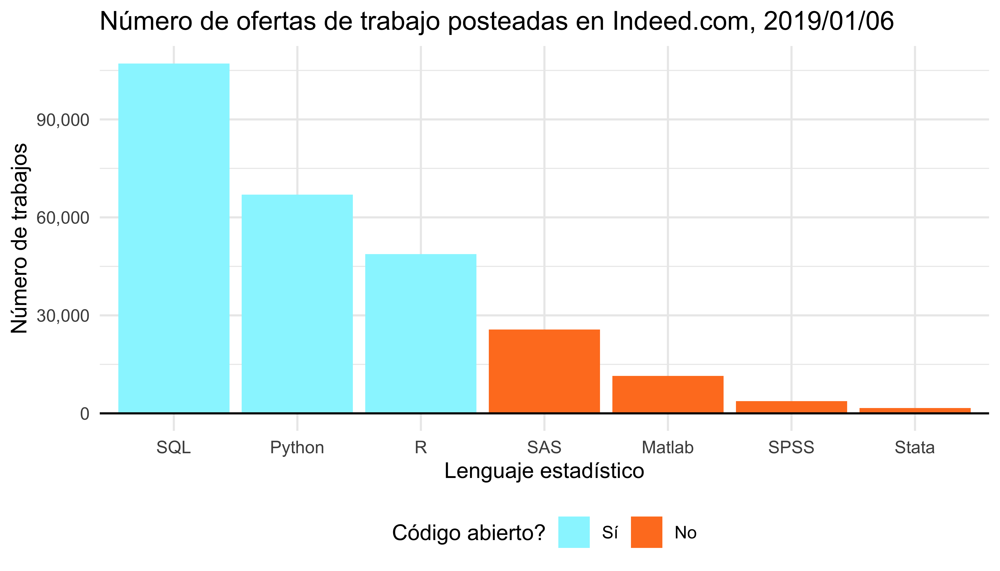
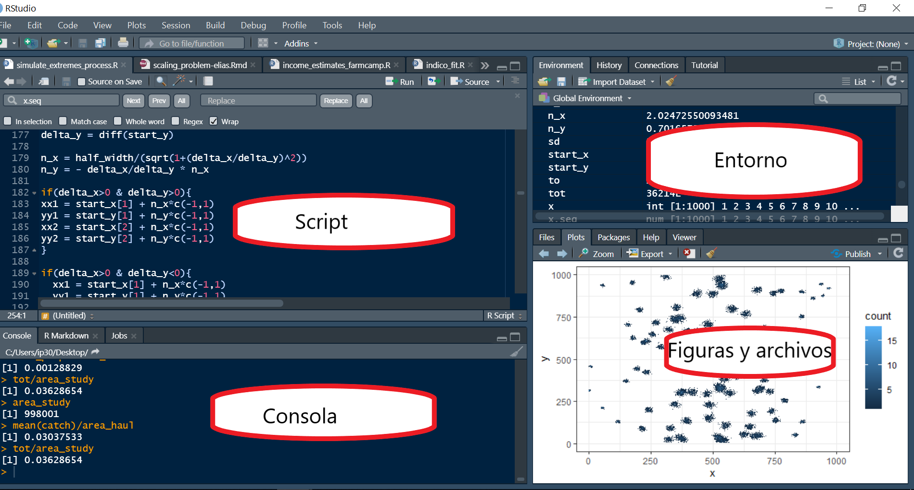

```{r setup, include=FALSE}
knitr::opts_chunk$set(
  echo    = TRUE,
  eval    = TRUE,
  message = FALSE,
  warning = FALSE,
  comment = "#>"
)
```

------------------------------------------------------------------------

> **Universidad de los Andes** \| Departamento de Economía\
> Clase complementaria — Viernes de 7 a 10 AM\
> Profesor magistral: Edicson Luna  ·  Asistente: Brayan David Flórez

------------------------------------------------------------------------

# Introducción al curso

## ¿De qué trata Econometría 1?

El método del economista tiene dos pilares fundamentales:

1.  **Modelos teóricos formales** para describir relaciones entre variables económicas.
2.  **Analítica de datos** para cuantificar dichas relaciones con base en información del mundo real.

Estas cuantificaciones se dividen en dos grandes grupos:

- **Estimación de relaciones causales:** ¿Cuánto aumenta el salario con un año adicional de educación? ¿Qué efecto tiene una política pública sobre las decisiones de las empresas?
- **Predicciones:** ¿Cuál será el crecimiento del PIB el próximo año? ¿Qué tan probable es que un deudor no pague?

El conjunto de herramientas estadísticas que usan los economistas para hacer estas cuantificaciones es la **econometría**. Este curso se enfoca en el **modelo de regresión lineal**.

## Información del equipo pedagógico

| Rol | Nombre | Correo |
|-------------------------|--------------------|---------------------------|
| Profesor magistral | Edicson Luna | [edicson\@sas.upenn.edu](mailto:edicson@sas.upenn.edu){.email} |
| Profesor complementario. | Brayan David Flórez | [b.florezl\@uniandes.edu.co](mailto:b.florezl@uniandes.edu.co){.email} |

- **Clase magistral:** Lunes, martes y jueves 8–10 AM; miércoles 7–10 AM\
- **Clase complementaria:** Viernes 7–10 AM *(esta clase)*

------------------------------------------------------------------------

# Objetivos del curso

Al finalizar exitosamente **Econometría 1**, el estudiante:

| Código | Resultado de aprendizaje |
|----------------------|--------------------------------------------------|
| **R.A.1** | Sabe cuantificar relaciones entre variables económicas. |
| **R.A.2** | Conoce los aspectos básicos del análisis econométrico. |
| **R.A.3** | Conoce las principales limitaciones del análisis econométrico. |
| **R.A.4** | Aplica el instrumental econométrico para diferenciar correlación de causalidad. |
| **R.A.5** | Propone e investiga preguntas empíricas con relevancia económica. |

**El objetivo de las clases complementarias** es que domines las herramientas computacionales (R) necesarias para alcanzar estos resultados de aprendizaje.

------------------------------------------------------------------------

# Organización del curso

## Cronograma general

| Semana | Fechas | Temas | Evaluación |
|------------------|------------------|------------------|------------------|
| **1** | 16 – 20 jun | Repaso de estadística | — |
| **2** | 23 – 27 jun | Repaso de estadística · Estimador OLS | **Quiz 1** · mié 25 jun |
| **3** | 30 jun – 4 jul | Insesgamiento · Inferencia estadística | **Quiz 2** · mié 2 jul |
| **4** | 7 – 11 jul | Tipos de variables · Teoría asintótica | — |
| **5** | 14 – 18 jul | Principios de inferencia causal | **Quiz 3** · mié 16 jul |
| **6** | 21 – 24 jul | Variable dicotómica dependiente · Presentaciones | **Examen Final** · jue 23 jul |

> **Presentaciones:** Última semana de clases

## Sistema de evaluación

**Estudiantes con 3 créditos:**

| Evaluación     | Porcentaje |
|----------------|------------|
| Quiz 1         | 10%        |
| Quiz 2         | 10%        |
| Quiz 3         | 10%        |
| Examen Final   | 20%        |
| Trabajo 1      | 20%        |
| Trabajo 2      | 20%        |
| Presentaciones | 10%        |

**Estudiantes con 4 créditos (con taller):**

| Evaluación      | Porcentaje |
|-----------------|------------|
| Quiz 1          | 10%        |
| Quiz 2          | 10%        |
| Quiz 3          | 10%        |
| Examen Final    | 20%        |
| Trabajo 1       | 15%        |
| Trabajo 2       | 15%        |
| Presentaciones  | 10%        |
| Manejo de datos | 10%        |

## Referencias del curso

- **(R)** Ross, S. (2017). *Introductory Statistics*, 4th ed.
- **(WO)** Wooldridge, J. M. (2010). *Introductory Econometrics: A Modern Approach*, 6th ed.
- **(AP)** Angrist & Pischke (2014). *Mastering Metrics: The Path from Cause to Effect.*
- **(MH)** Angrist & Pischke (2008). *Mostly Harmless Econometrics.*

------------------------------------------------------------------------

# Hoy veremos

1.  **Motivación** — ¿por qué aprender R?\
2.  **¿Por qué usar R?** — ventajas frente a otras herramientas\
3.  **Configuración inicial** — instalar R y RStudio\
4.  **Interfaz de RStudio** — paneles y flujo de trabajo\
5.  **Primeros pasos en R** — objetos, operaciones, vectores, data frames y funciones básicas

------------------------------------------------------------------------

# Motivación: ¿por qué aprender R?

## R en el mercado laboral colombiano

Una forma de medir la popularidad de un lenguaje es observar cuántas ofertas de trabajo lo requieren. Los siguientes gráficos muestran la demanda de lenguajes estadísticos en Colombia y en el mercado global.

```{r graf-colombia, echo=FALSE, fig.cap="Top lenguajes de programación para economistas en Colombia. Fuente: Computrabajo (Excel excluido).", out.width="85%", fig.align="center"}

```

**Lectura del gráfico:** En las ofertas de trabajo para economistas en Colombia, **R es el segundo lenguaje más demandado** (≈12%), después de SQL y por encima de Python. Stata, que fue el estándar histórico en economía, aparece con apenas \~2%.

## R en el mercado laboral global

```{r graf-indeed, echo=FALSE, fig.cap="Número de ofertas de trabajo en Indeed.com por lenguaje estadístico (enero 2019). Los lenguajes de código abierto (azul) dominan el mercado.", out.width="85%", fig.align="center"}

```

**Lectura del gráfico:** A nivel global, **R ocupa el tercer lugar** en número de ofertas de trabajo en Indeed.com, con alrededor de 45.000 publicaciones. Los tres lenguajes más demandados (SQL, Python y R) son todos de **código abierto y gratuitos**. Stata y SPSS, que son de pago, quedan muy rezagados.

## Conclusión: ¿por qué R y no Stata?

| Criterio                 | R            | Stata     | Python       | Excel    |
|--------------------------|--------------|-----------|--------------|----------|
| Costo                    | **Gratuito** | De pago   | **Gratuito** | De pago  |
| Reproducibilidad         | Alta         | Alta      | Alta         | Baja     |
| Econometría              | Excelente    | Excelente | Buena        | Limitada |
| Visualización            | Excelente    | Buena     | Excelente    | Básica   |
| Machine learning         | Excelente    | Limitada  | Excelente    | Ninguna  |
| Demanda laboral Colombia | 2°           | 6°        | 3°           | —        |
| Comunidad activa         | Muy grande   | Grande    | Muy grande   | Grande   |

> **Conclusión:** R es gratuito, está entre los más demandados en Colombia y el mundo, y es el estándar en investigación económica reproducible. Aprender R es una inversión de alto retorno para tu carrera.
>
> # 

# Configuración inicial

## Instalar R

1.  Ve a <https://cran.r-project.org/>
2.  Selecciona tu sistema operativo (Windows / macOS / Linux).
3.  Descarga la versión más reciente (R 4.x.x).
4.  Sigue el instalador con las opciones por defecto.

## Instalar RStudio

1.  Ve a <https://posit.co/download/rstudio-desktop/>
2.  Descarga la versión gratuita de **RStudio Desktop**.
3.  Instala **después** de haber instalado R.

> **Importante:** R es el motor; RStudio es la cabina de pilotaje. Necesitas ambos.

## Instalar paquetes

Los **paquetes** (o librerías) extienden las capacidades de R. En este curso usaremos principalmente:

```{r instalar-paquetes, eval=FALSE}
# Ejecuta esto UNA sola vez en tu computador
install.packages("tidyverse")   # manipulación y visualización de datos
install.packages("haven")       # leer archivos .dta (Stata), .sav (SPSS)
install.packages("readxl")      # leer archivos Excel
install.packages("stargazer")   # tablas de regresión
install.packages("lmtest")      # pruebas sobre modelos lineales
install.packages("sandwich")    # errores estándar robustos
```

Una vez instalados, se cargan con `library()` al inicio de cada sesión:

```{r cargar-paquetes}
library(tidyverse)
```

------------------------------------------------------------------------

# Interfaz de RStudio

## Los cuatro paneles principales

```{}
```

| Panel            | Función principal                                  |
|------------------|----------------------------------------------------|
| **Editor**       | Escribir y guardar scripts o documentos R Markdown |
| **Consola**      | Ejecutar comandos directamente; ver resultados     |
| **Environment**  | Ver los objetos creados en la sesión actual        |
| **Plots / Help** | Ver gráficas, buscar documentación de funciones    |

## Atajos de teclado útiles

| Acción                       | Windows/Linux      | macOS              |
|------------------------------|--------------------|--------------------|
| Ejecutar línea/selección     | `Ctrl + Enter`     | `Cmd + Enter`      |
| Insertar chunk en R Markdown | `Ctrl + Alt + I`   | `Cmd + Option + I` |
| Compilar (Knit) el documento | `Ctrl + Shift + K` | `Cmd + Shift + K`  |
| Comentar/descomentar líneas  | `Ctrl + Shift + C` | `Cmd + Shift + C`  |
| Autocompletar                | `Tab`              | `Tab`              |

## Configurar el directorio de trabajo

```{r directorio-trabajo, eval=FALSE}
# Ver dónde está trabajando R ahora mismo
getwd()

# Cambiar el directorio de trabajo (ajusta la ruta a tu computador)
setwd("C:/Users/TuUsuario/Documentos/econometria1")


```

------------------------------------------------------------------------

# Primeros pasos en R

## R como calculadora

R puede usarse como una calculadora sofisticada directamente en la consola:

```{r calculadora}
# Operaciones aritméticas básicas
2 + 3
10 - 4
6 * 7
15 / 4
2^10          # potenciación
sqrt(144)     # raíz cuadrada
log(exp(1))   # logaritmo natural
```

Los `#` son **comentarios**: R los ignora al ejecutar el código. Usenlos siempre para documentar tu trabajo.

## Asignación de objetos

En R, los resultados se guardan en **objetos** con el operador `<-` (o `=`):

```{r asignacion}
# Crear objetos
x <- 5
y <- 3
z <- x + y
z

# También puedes usar =, aunque <- es la convención para evitar confusiones
nombre <- "Econometría 1"
nombre
```

El panel **Environment** muestra todos los objetos creados en la sesión.

## Tipos de datos básicos

```{r tipos-datos}
# Numérico (numeric)
salario <- 3500000
class(salario)

# Texto / cadena (character)
ciudad <- "Bogotá"
class(ciudad)

# Lógico (logical)
es_estudiante <- TRUE
class(es_estudiante)

# Entero (integer)
semestre <- 5L
class(semestre)
```

## Vectores

Un **vector** es una secuencia de elementos del mismo tipo. Es la estructura más básica de R:

```{r vectores}
# Crear vectores con c() (concatenar)
edades    <- c(20, 21, 19, 22, 20, 23)
nombres   <- c("Ana", "Luis", "María", "Carlos", "Juan", "Sofía")
en_beca   <- c(TRUE, FALSE, TRUE, FALSE, TRUE, FALSE)

# Longitud del vector
length(edades)

# Acceder a elementos por posición (índice empieza en 1)
edades[1]       # primer elemento
edades[3]       # tercer elemento
edades[2:4]     # elementos del 2 al 4
edades[c(1,5)]  # elementos 1 y 5
```

### Operaciones sobre vectores

```{r operaciones-vectores}
# Las operaciones se aplican elemento a elemento
salarios <- c(2800000, 3500000, 4200000, 3100000, 2950000, 5000000)

# Transformaciones
salarios_millones <- salarios / 1e6
salarios_millones

# Estadísticas básicas
mean(salarios)     # media
median(salarios)   # mediana
sd(salarios)       # desviación estándar
var(salarios)      # varianza
min(salarios)      # mínimo
max(salarios)      # máximo
sum(salarios)      # suma
```

### Filtrar vectores con condiciones lógicas

```{r filtrar-vectores}
# ¿Cuáles edades son mayores a 20?
edades > 20

# Extraer solo los elementos que cumplen la condición
edades[edades > 20]

# Operadores lógicos:
# >  mayor que    |  <  menor que
# >= mayor o igual|  <= menor o igual
# == igual a      |  != diferente de
# &  Y (and)      |  |  O (or)
# !  NO (negación)

edades[edades >= 20 & edades <= 22]
```

## Matrices

```{r matrices}
# Crear una matriz
M <- matrix(1:9, nrow = 3, ncol = 3)
M

# Dimensiones
dim(M)
nrow(M)
ncol(M)

# Acceso a elementos: M[fila, columna]
M[2, 3]     # fila 2, columna 3
M[1, ]      # toda la fila 1
M[, 2]      # toda la columna 2

# Álgebra matricial (relevante para OLS)
A <- matrix(c(1, 2, 3, 4), nrow = 2)
B <- matrix(c(5, 6, 7, 8), nrow = 2)

A %*% B      # multiplicación matricial
t(A)         # transpuesta
solve(A)     # inversa (si existe)
```

## Data Frames

El **data frame** es la estructura más importante en econometría: una tabla donde cada columna es una variable y cada fila es una observación.

```{r dataframes}
# Crear un data frame
estudiantes <- data.frame(
  nombre    = c("Ana", "Luis", "María", "Carlos", "Juan", "Sofía"),
  semestre  = c(5, 5, 4, 5, 6, 4),
  promedio  = c(3.9, 3.5, 4.1, 3.2, 3.7, 4.3),
  beca      = c(TRUE, FALSE, TRUE, FALSE, TRUE, FALSE)
)

# Ver el data frame
estudiantes

# Dimensiones
nrow(estudiantes)   # número de observaciones
ncol(estudiantes)   # número de variables

# Nombres de las variables (columnas)
names(estudiantes)

# Primeras y últimas filas
head(estudiantes, 3)
tail(estudiantes, 2)

# Resumen estadístico
summary(estudiantes)
```

### Acceder a variables de un data frame

```{r acceso-dataframe}
# Con el operador $
estudiantes$promedio

# Con corchetes [fila, columna]
estudiantes[1, ]          # primera observación (fila)
estudiantes[, "promedio"] # columna por nombre
estudiantes[2, 3]         # fila 2, columna 3
```

### Filtrar filas

```{r filtrar-dataframe}
# Estudiantes con promedio mayor a 3.8
estudiantes[estudiantes$promedio > 3.8, ]

# Con la función subset()
subset(estudiantes, beca == TRUE)

# Con tidyverse (filter)
library(dplyr)
filter(estudiantes, semestre == 5 & promedio > 3.5)
```

### Agregar variables

```{r agregar-variables}
# Crear nueva columna
estudiantes$promedio_ponderado <- estudiantes$promedio * 1.1

# Con mutate (tidyverse)
estudiantes <- mutate(estudiantes,
                      es_excelente = promedio >= 4.0)
estudiantes
```

## Funciones

En R todo se hace con **funciones**. También puedes crear las tuyas:

```{r funciones}
# Estructura:
# nombre_funcion <- function(arg1, arg2, ...) {
#   cuerpo
#   return(resultado)
# }

# Ejemplo: calcular el coeficiente de variación
coef_variacion <- function(x) {
  cv <- sd(x) / mean(x) * 100
  return(cv)
}

coef_variacion(estudiantes$promedio)

# Función con valor por defecto
describir <- function(x, decimales = 2) {
  cat("N         :", length(x), "\n")
  cat("Media     :", round(mean(x),   decimales), "\n")
  cat("Mediana   :", round(median(x), decimales), "\n")
  cat("Desv. Est.:", round(sd(x),     decimales), "\n")
  cat("Mín       :", round(min(x),    decimales), "\n")
  cat("Máx       :", round(max(x),    decimales), "\n")
}

describir(estudiantes$promedio)
```

## Leer datos externos

```{r leer-datos, eval=FALSE}
# CSV (el más común)
datos <- read.csv("ruta/al/archivo.csv")

# Con readr (tidyverse)
library(readr)
datos <- read_csv("ruta/al/archivo.csv")

# Excel
library(readxl)
datos <- read_excel("ruta/al/archivo.xlsx", sheet = 1)

# Stata (.dta) — muy común en economía
library(haven)
datos <- read_dta("ruta/al/archivo.dta")

# Explorar al cargar — siempre empieza con estas funciones
dim(datos)
head(datos)
glimpse(datos)    # tidyverse
summary(datos)
```

## Visualización básica con ggplot2

`ggplot2` (parte del tidyverse) es el estándar para gráficas en R. La lógica es añadir capas con `+`:

```{r visualizacion-basica}
library(ggplot2)

# Histograma de promedios
ggplot(data = estudiantes, aes(x = promedio)) +
  geom_histogram(binwidth = 0.2, fill = "#1d6fa4", color = "white") +
  labs(
    title = "Distribución de promedios",
    x     = "Promedio académico",
    y     = "Frecuencia"
  ) +
  theme_minimal()
```

```{r grafico-dispersion}
# Gráfico de dispersión — anticipo de regresión OLS
datos_sim <- data.frame(
  educacion = c(8, 10, 12, 14, 15, 16, 17, 18, 16, 14, 12, 11),
  salario   = c(1.5, 2.0, 2.8, 3.5, 4.0, 4.8, 5.5, 6.2, 4.5, 3.2, 2.5, 2.2)
)

ggplot(datos_sim, aes(x = educacion, y = salario)) +
  geom_point(color = "#1d6fa4", size = 3) +
  geom_smooth(method = "lm", se = TRUE, color = "#e63946") +
  labs(
    title    = "Educación vs. Salario (datos simulados)",
    subtitle = "La línea roja es la regresión OLS — tema central del curso",
    x        = "Años de educación",
    y        = "Salario (millones COP)"
  ) +
  theme_minimal()
```

------------------------------------------------------------------------

# Anticipo: el modelo OLS en R

En las clases magistrales aprenderás la teoría del OLS. En las clases complementarias aprenderás a estimarlo en R:

```{r ols-preview}
# Estimar una regresión lineal simple: salario ~ educación
modelo <- lm(salario ~ educacion, data = datos_sim)

# Ver resultados
summary(modelo)
```

```{r coeficientes}
# Extraer coeficientes
coef(modelo)

# Intervalos de confianza (95%)
confint(modelo, level = 0.95)
```

> En las próximas clases complementarias aprenderás a interpretar estos resultados, trabajar con datos reales y construir modelos de regresión múltiple.

------------------------------------------------------------------------

# Consejos para el curso

1.  **Escribe código todos los días.** Como cualquier idioma, R se aprende practicando.
2.  **Comenta tu código.** Usa `#` para explicar qué hace cada bloque.
3.  **Usa proyectos de RStudio.** Mantén tu trabajo organizado por carpetas.
4.  **Busca en la documentación.** `?nombre_funcion` en la consola abre la ayuda.
5.  **No copies y pegues sin entender.** Reproducibilidad ≠ copy-paste ciego.

------------------------------------------------------------------------

# Recursos adicionales

- **Swirl:** aprende R interactivamente desde la consola → `install.packages("swirl"); swirl::swirl()`
- **R for Data Science** (Hadley Wickham): <https://r4ds.had.co.nz/> — gratuito en línea
- **Hands-On Programming with R**: <https://rstudio-education.github.io/hopr/>
- **Documentación de tidyverse**: <https://www.tidyverse.org/>
- **StackOverflow en español**: <https://es.stackoverflow.com/>

------------------------------------------------------------------------

# Ejercicios prácticos

## Ejercicio 1: Objetos y vectores

```{r ejercicio-1, eval=FALSE}
# 1a. Crea un vector `pib` con los crecimientos del PIB colombiano (%):
#     2.6, 3.3, 1.4, -6.8, 10.6, 7.3, 0.6
#     Calcula la media, la mediana y la desviación estándar.

# 1b. Crea un vector lógico que indique cuáles años tuvieron crecimiento negativo.
#     ¿Cuántos años tuvieron crecimiento negativo?

# 1c. Calcula el crecimiento promedio excluyendo el año con caída más profunda.
```

## Ejercicio 2: Data Frames

```{r ejercicio-2, eval=FALSE}
# 2a. Crea un data frame `empresas` con:
#     - nombre: "Ecopetrol", "Bancolombia", "Grupo Éxito", "Cementos Argos", "ISA"
#     - sector: "Energía", "Financiero", "Retail", "Industria", "Energía"
#     - empleados: 8000, 26000, 35000, 5500, 6000
#     - utilidad_millones: 12500, 8300, -200, 650, 1100

# 2b. Filtra las empresas con utilidad positiva.
# 2c. ¿Cuál es el promedio de empleados?
# 2d. Agrega una columna con la utilidad por empleado.
```

## Ejercicio 3: Visualización

```{r ejercicio-3, eval=FALSE}
# Usando los datos del Ejercicio 2:
# 3a. Haz un gráfico de barras del número de empleados por empresa.
# 3b. Haz un gráfico de dispersión entre empleados y utilidad.
#     ¿Hay alguna relación visual entre estas dos variables?
```

------------------------------------------------------------------------

*Clase preparada para Econometría 1 — ECON 3311 / ECON 3321 \| Universidad de los Andes \| 2026-19*
